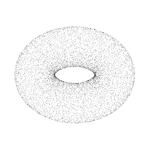

# Path to 3D-Vision
The repository involves my path into **Machine Learning with 3D Vision**.
## Basics
### Mesh

A 3D mesh is the structural build of a 3D model consisting of polygons. 3D meshes use reference points in X, Y and Z axes to define shapes with height, width and depth.

### Point Cloud

A point cloud is a set of data points in space. The points may represent a 3D shape or object. Each point position has its set of Cartesian coordinates. 

### Chamfer Distance
The Chamfer distance is computed by summing the squared distances between nearest neighbor correspondences of two point clouds.

### Mesh Smoothing Algorithms
#### mesh_edge_length
Minimizes the length of the edges in the predicted mesh.
#### mesh_normal_consistency
enforces consistency across the normals of neighboring faces.
#### mesh_laplacian_smoothing
Laplacian smoothing is an algorithm to smooth a polygonal mesh. For each vertex in a mesh, a new position is chosen based on local information (such as the position of neighbours) and the vertex is moved there. In the case that a mesh is topologically a rectangular grid (that is, each internal vertex is connected to four neighbours) then this operation produces the Laplacian of the mesh.